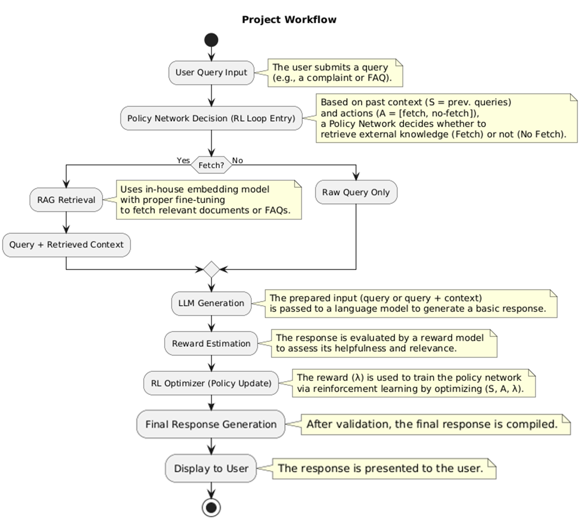

# 🏦 QUESTRAG - Banking QUEries and Support system via Trained Reinforced RAG

[](https://www.python.org/downloads/)
[](https://fastapi.tiangolo.com/)
[](https://reactjs.org/)
[](https://opensource.org/licenses/MIT)

> An intelligent banking chatbot powered by **Retrieval-Augmented Generation (RAG)** and **Reinforcement Learning (RL)** to provide accurate, context-aware responses to Indian banking queries while optimizing token costs.

---

## 📋 Table of Contents
- [Overview](#overview)
- [Key Features](#key-features)
- [System Architecture](#system-architecture)
- [Technology Stack](#technology-stack)
- [Installation](#installation)
- [Configuration](#configuration)
- [Usage](#usage)
- [Project Structure](#project-structure)
- [Datasets](#datasets)
- [Performance Metrics](#performance-metrics)
- [API Documentation](#api-documentation)
- [Contributing](#contributing)
- [License](#license)
- [Acknowledgments](#acknowledgments)
- [Contact](#contact)
- [Links](#links)

---

## 🎯 Overview
QUESTRAG is an **advanced banking chatbot** designed to revolutionize customer support in the Indian banking sector. By combining **Retrieval-Augmented Generation (RAG)** with **Reinforcement Learning (RL)**, the system intelligently decides when to fetch external context from a knowledge base and when to respond directly, **reducing token costs by up to 31%** while maintaining high accuracy.

### Problem Statement
Existing banking chatbots suffer from:
- ❌ Limited response flexibility (rigid, rule-based systems)
- ❌ Poor handling of informal/real-world queries
- ❌ Lack of contextual understanding
- ❌ High operational costs due to inefficient token usage
- ❌ Low user satisfaction and trust

### Solution
QUESTRAG addresses these challenges through:
- ✅ **Domain-specific RAG** trained on RBI regulations and banking policies  
- ✅ **RL-optimized policy network** (BERT-based) for smart context-fetching decisions  
- ✅ **Fine-tuned retriever model** using InfoNCE + Triplet Loss  
- ✅ **Automated response evaluation** with reward-based learning  
- ✅ **Full-stack web application** with modern UI/UX  

---

## 🌟 Key Features
### 🤖 Intelligent RAG Pipeline
- **FAISS-powered retrieval** for fast similarity search across 19,000+ documents  
- **Fine-tuned embedding model** (`e2-base-v5`) trained on English + Hinglish paraphrases  
- **Context-aware response generation** using Gemini 2.0 Flash Lite  

### 🧠 Reinforcement Learning System
- **BERT-based policy network** (`bert-base-uncased`) for FETCH/NO_FETCH  
- **Reward-driven optimization** (+2 accurate, +0.5 needed fetch, -0.5 incorrect)  
- **31% token cost reduction** via optimized retrieval  

### 🎨 Modern Web Interface
- **React 18 + Vite** with Tailwind CSS  
- **Real-time chat**, session management, JWT auth, responsive UI  

### 🔐 Enterprise-Ready Backend
- **FastAPI + MongoDB** for scalable async ops  
- **Role-based access control**, API rate-limiting, and secure logging  

---

## 🏗️ System Architecture

<p align="center">
  
</p>

### 🔄 Workflow
1. **User Query** → FastAPI receives query via REST API  
2. **Policy Decision** → BERT-based RL model decides FETCH or NO_FETCH  
3. **Conditional Retrieval** → If FETCH → Retrieve top-5 docs from FAISS  
4. **Response Generation** → Gemini generates final answer  
5. **Evaluation & Logging** → Logged in MongoDB + reward-based model update  

---

## 🛠️ Technology Stack

### **Frontend**
- ⚛️ React 18.3.1 + Vite 5.4.2  
- 🎨 Tailwind CSS 3.4.1  
- 🔄 React Context API + Axios + React Router DOM  

### **Backend**
- 🚀 FastAPI 0.104.1  
- 🧩 MongoDB + Motor (async driver)  
- 🔑 JWT Auth + Passlib (bcrypt)  
- 🤖 PyTorch, Transformers, FAISS, LangChain  
- 💬 Gemini 2.0 Flash Lite (Response Generation)  

### **DevOps**
- 🧰 Python `venv` + npm  
- 🌿 `python-dotenv` for env vars  
- 🪵 Logging with Python `logging`  
- 🧠 Version Control via Git  

---

## ⚙️ Installation

### 🧩 Prerequisites
- Python 3.12+  
- Node.js 18+  
- MongoDB 6.0+  
- Gemini API key  

### ⚙️ Backend Setup
```bash
# Navigate to backend
cd backend

# Create virtual environment
python -m venv venv
# Activate it
source venv/bin/activate       # For Linux/Mac
venv\Scripts\activate          # For Windows

# Install dependencies
pip install -r requirements.txt

# Create environment file
cp .env.example .env
# Edit .env to include API keys and Mongo URI
````

### 💻 Frontend Setup

```bash
# Navigate to frontend
cd frontend

# Install dependencies
npm install

# Create environment file
cp .env.example .env
# Edit VITE_API_URL to your backend URL
```

---

## ⚙️ Configuration

### 🧠 Backend `.env` (Key Parameters)

| **Category**   | **Key**                                                         | **Example / Description**   |
| -------------- | --------------------------------------------------------------- | --------------------------- |
| Environment    | `ENVIRONMENT`                                                   | `development`               |
| MongoDB        | `MONGODB_URI`                                                   | `mongodb://localhost:27017` |
| Authentication | `SECRET_KEY`, `ALGORITHM`, `ACCESS_TOKEN_EXPIRE_MINUTES`        | JWT configs                 |
| Gemini API     | `GOOGLE_API_KEY`, `GEMINI_MODEL`                                | Model & key                 |
| Model Paths    | `POLICY_MODEL_PATH`, `RETRIEVER_MODEL_PATH`, `FAISS_INDEX_PATH` | Paths to models             |
| Device         | `DEVICE`                                                        | `cpu` or `cuda`             |
| RAG Params     | `TOP_K`, `SIMILARITY_THRESHOLD`                                 | Control context fetching    |
| Policy         | `POLICY_MAX_LEN`, `CONFIDENCE_THRESHOLD`                        | Policy network configs      |
| CORS           | `ALLOWED_ORIGINS`                                               | `http://localhost:5173`     |

### 🌐 Frontend `.env`

```env
VITE_API_URL=http://localhost:8000
```

---

## 🚀 Usage

### ▶️ Start Backend Server

```bash
cd backend
source venv/bin/activate  # or venv\Scripts\activate
uvicorn app.main:app --reload --port 8000
```

Backend → `http://localhost:8000`
Docs → `http://localhost:8000/docs`

### 💻 Start Frontend Dev Server

```bash
cd frontend
npm run dev
```

Frontend → `http://localhost:5173`

### 🌍 Access Application

1. Open browser → `http://localhost:5173`
2. Register or login
3. Chat with your AI banking assistant 🚀

---

## 📁 Project Structure

```
questrag/
│
├── backend/
│   ├── app/
│   │   ├── api/v1/
│   │   │   ├── auth.py              # Authentication endpoints
│   │   │   └── chat.py              # Chat endpoints
│   │   ├── core/
│   │   │   ├── llm_manager.py       # LLM orchestration
│   │   │   └── security.py          # JWT & password hashing
│   │   ├── ml/
│   │   │   ├── policy_network.py    # RL Policy model
│   │   │   └── retriever.py         # Document retriever
│   │   ├── repositories/
│   │   │   ├── user_repository.py
│   │   │   └── conversation_repo.py
│   │   ├── services/chat_service.py # Orchestration logic
│   │   ├── models/                  # Trained model files
│   │   ├── config.py
│   │   └── main.py
│   ├── requirements.txt
│   └── .env
│
└── frontend/
    ├── src/
    │   ├── components/              # UI Components
    │   ├── context/                 # Auth Context
    │   ├── pages/                   # Login, Register, Chat
    │   ├── services/api.js          # Axios Client
    │   ├── App.jsx
    │   └── main.jsx
    ├── package.json
    └── .env
```

---

## 📊 Datasets

### 1. Final Knowledge Base
- **Size**: 19,352 question-answer pairs
- **Categories**: 15 banking categories
- **Intents**: 22 unique intents (focused on ATM, CARD, LOAN, ACCOUNT)
- **Source**: Combination of:
  - Bitext Retail Banking Dataset (Hugging Face)
  - RetailBanking-Conversations Dataset
  - Manually curated FAQs from SBI, ICICI, HDFC, Yes Bank, Axis Bank

### 2. Retriever Training Dataset
- **Size**: 11,655 paraphrases
- **Source**: 1,665 unique FAQs from knowledge base
- **Paraphrases per FAQ**:
  - 4 English paraphrases
  - 2 Hinglish paraphrases
  - Original FAQ
- **Training**: InfoNCE Loss + Triplet Loss

### 3. Policy Network Training Dataset
- **Size**: 182 queries from 6 chat sessions
- **Format**: (state, action, reward) tuples
- **Actions**: FETCH (1) or NO_FETCH (0)
- **Rewards**: +2.0, +0.5, -0.5

---


## 📚 API Documentation

### Authentication

#### Register
POST /api/v1/auth/register
Content-Type: application/json
```
{
"username": "john_doe",
"email": "john@example.com",
"password": "securepassword123"
}
```


#### Login
POST /api/v1/auth/login
Content-Type: application/json

```
{
"username": "john_doe",
"password": "securepassword123"
}
```
Response:
```
{
"access_token": "eyJhbGciOiJIUzI1NiIs...",
"token_type": "bearer"
}
```
---

### Chat

#### Send Message
POST /api/v1/chat/
Authorization: Bearer <token>
Content-Type: application/json
```
{
"query": "What are the interest rates for home loans?",
"session_id": "optional-session-id"
}
```
Response:
```
{
"response": "Current home loan interest rates range from 8.5% to 9.5% per annum...",
"session_id": "abc123",
"metadata": {
"policy_action": "FETCH",
"retrieval_score": 0.89,
"documents_retrieved": 5
}
}
```

#### Get Conversation History
GET /api/v1/chat/history/{session_id}
Authorization: Bearer <token>

Response:
```
{
"session_id": "abc123",
"messages": [
{
"role": "user",
"content": "What are the interest rates?",
"timestamp": "2025-10-29T10:30:00Z"
},
{
"role": "assistant",
"content": "Current rates are...",
"timestamp": "2025-10-29T10:30:05Z"
}
]
}
```


---


## 🤝 Contributing

Contributions are welcome! Please follow these steps:

1. Fork the repository
2. Create a feature branch (`git checkout -b feature/amazing-feature`)
3. Commit your changes (`git commit -m 'Add amazing feature'`)
4. Push to the branch (`git push origin feature/amazing-feature`)
5. Open a Pull Request

### Development Guidelines
- Follow PEP 8 for Python code
- Use ESLint + Prettier for JavaScript/React
- Write comprehensive docstrings and comments
- Add unit tests for new features
- Update documentation accordingly

---

## 📄 License

MIT License — see [LICENSE](LICENSE)

---

## 🙏 Acknowledgments
### Research Inspiration
- **Main Paper**: "Optimizing Retrieval Augmented Generation for Domain-Specific Chatbots with Reinforcement Learning" (AAAI 2024)
- **Additional References**:
  - "Evaluating BERT-based Rewards for Question Generation with RL"
  - "Self-Reasoning for Retrieval-Augmented Language Models"

### Open Source Resources
- [RL-Self-Improving-RAG](https://github.com/subrata-samanta/RL-Self-Improving-RAG)
- [ARENA](https://github.com/ren258/ARENA)
- [RAGTechniques](https://github.com/NirDiamant/RAGTechniques)
- [Financial-RAG-From-Scratch](https://github.com/cse-amarjeet/Financial-RAG-From-Scratch)

### Datasets
- [Bitext Retail Banking Dataset](https://huggingface.co/datasets/bitext/Bitext-retail-banking-llm-chatbot-training-dataset)
- [RetailBanking-Conversations](https://huggingface.co/datasets/oopere/RetailBanking-Conversations)
  
---

## 📞 Contact

**Eeshanya Amit Joshi**
📧 [eeshanyajoshi@example.com](mailto:eeshanyajoshi@example.com)
🐙 [@yourusername](https://github.com/yourusername)
💼 [LinkedIn](https://linkedin.com/in/yourprofile)

---

## 🔗 Links

* **Live Demo:** Coming Soon
* **API Docs:** `http://localhost:8000/docs`
* **Research Paper:** [AAAI 2024 Workshop](https://arxiv.org/abs/2401.06800)

---

<p align="center">✨ Made with ❤️ for the Banking Industry ✨</p>
